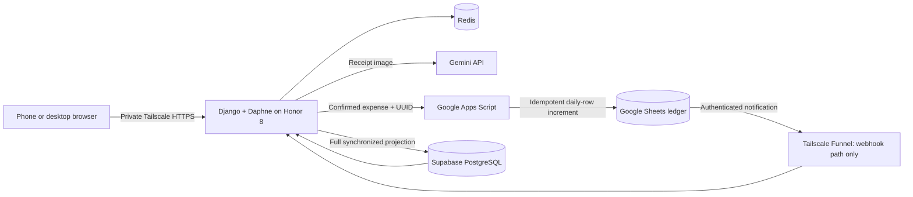

# Household Finance Receipt Pipeline

A working household-finance system that turns mobile receipt photos into reviewed Google Sheets expenses while preserving an existing spreadsheet-led workflow.

The application runs on a rooted 2016 Honor 8 Android phone. Django provides the dashboard and receipt workflow, Gemini extracts structured receipt data, Google Apps Script performs idempotent ledger updates, Supabase PostgreSQL holds a synchronized dashboard projection, and Tailscale provides private HTTPS access.

This project is intentionally not a greenfield rewrite. Its central engineering challenge was extending a live household spreadsheet without changing its ownership model: **Google Sheets remains authoritative; PostgreSQL remains a read projection.**

## What it does

- Displays monthly household-finance charts and category breakdowns.
- Synchronizes monthly Google Sheets worksheets into PostgreSQL/Supabase.
- Accepts one or multiple receipt photos from a mobile browser.
- Supports PNG, ordinary JPEG, and iPhone multi-picture JPEG/MPO uploads.
- Sends images directly to Gemini for structured extraction.
- Requires a user to review and edit store, date, amount, category, and items.
- Writes only confirmed values to the appropriate daily Google Sheets row.
- Prevents duplicate financial increments using receipt UUIDs and Apps Script Properties.
- Refreshes the PostgreSQL projection asynchronously after a Sheet write.
- Keeps the application private to approved Tailscale users.
- Publishes only the authenticated synchronization webhook to Google Apps Script.

## Architecture



### Source-of-truth rule

```text
Google Sheets → authenticated webhook → PostgreSQL projection → dashboard
```

Django receipt records are processing and audit state. They do not replace the ledger. Apps Script updates the real Sheet first; the existing Sheet-to-PostgreSQL synchronization then refreshes the dashboard projection.

## Receipt lifecycle

```text
uploaded → processing → extracted → confirmed → synced
                    ↘ extraction_failed   ↘ sync_failed → safe retry
```

1. Django validates and stores an uploaded image under a UUID.
2. Gemini returns structured JSON.
3. The user edits and explicitly confirms the extracted values.
4. Django sends only the confirmed financial fields and receipt UUID to Apps Script.
5. Apps Script locks the document, validates the target worksheet and date row, and increments the selected category and `Total_amount`.
6. Script Properties record `pending` and `synced` UUID states to prevent duplicates.
7. A deferred Apps Script trigger invokes the authenticated Django synchronization webhook.
8. Django refreshes Supabase; the dashboard continues to query PostgreSQL.

## Technology

| Layer | Technology |
|---|---|
| Backend | Django 4.2, Python, Daphne/ASGI |
| Dashboard | Django templates, Bootstrap, Chart.js |
| Pipeline state | Django `Receipt` model |
| Projection | Supabase PostgreSQL |
| Channel layer | Redis, Django Channels |
| Ledger | Google Sheets |
| Integration | Google Sheets API, Google Apps Script |
| Extraction | Gemini structured JSON API |
| Image validation | Pillow |
| Private access | Tailscale Serve |
| Public machine webhook | Tailscale Funnel on a separate port/path |
| Host | Rooted Honor 8, Android 7, Termux ARM64 |

## Security model

- Dashboard, upload, confirmation, and media workflows are tailnet-only.
- A separate Funnel listener exposes only `/expenses_webhook/`; `/upload/` and `/dashboard/` do not exist on that public listener.
- Apps Script notifications require `X-Webhook-Secret`, checked with constant-time comparison before any Sheet or database work.
- Receipt writes use a different shared secret in the JSON body.
- Secrets, service-account credentials, receipt images, and `.env` files are excluded from Git.
- Receipt UUID idempotency prevents retries from incrementing the Sheet twice.
- Ambiguous `pending` writes fail conservatively and require reconciliation.

## Engineering constraints and tradeoffs

The final design is shaped by real constraints rather than idealized infrastructure:

- A rooted Honor 8 had to remain the host.
- Android 7 had no `/dev/net/tun`, so Tailscale runs in userspace-networking mode.
- Docker/Podman and local PostgreSQL were explored, but the Android kernel, storage, memory, networking, and package friction made a full container stack unsuitable.
- PostgreSQL was moved out of the phone's critical runtime and retained in Supabase.
- Native ARM/Termux Python dependencies had to build on-device; pandas was removed from synchronization in favor of standard Python data structures.
- Android background execution required Termux:Boot, a CPU wake lock, Doze exemption, and idempotent boot scripts.
- Tailscale HTTPS needed an Android-specific DNS forwarder and explicit Termux CA bundle.
- Apps Script initially held the receipt request open while refreshing every worksheet. A deferred one-time trigger reduced a multi-minute false failure to a short acknowledged write.
- iPhone JPEGs can be decoded by Pillow as `MPO`; validation was extended without accepting arbitrary files.

See [Engineering Journey](docs/ENGINEERING_JOURNEY.md) for the full problem-solving narrative and [Operations Runbook](docs/OPERATIONS.md) for deployment and troubleshooting.

## Configuration

Configuration is environment-driven. Required names include:

```text
DJANGO_SECRET_KEY
DJANGO_ALLOWED_HOSTS
SUPABASE_LINK
SUPABASE_DB_PASSWORD
REDIS_HOST
GEMINI_API_KEY
GEMINI_RECEIPT_MODEL
GEMINI_RECEIPT_TIMEOUT
APPS_SCRIPT_RECEIPT_URL
APPS_SCRIPT_RECEIPT_SHARED_SECRET
APPS_SCRIPT_RECEIPT_TIMEOUT
EXPENSES_WEBHOOK_SHARED_SECRET
```

Apps Script uses matching Script Properties:

```text
RECEIPT_WRITE_SHARED_SECRET
EXPENSES_WEBHOOK_SHARED_SECRET
```

## Local development

```bash
python -m venv venv
. venv/bin/activate
pip install -r requirements.txt
python manage.py check
python manage.py migrate --plan
daphne -b 127.0.0.1 -p 8000 expenses_site.asgi:application
```

The configured application database is Supabase. Tests that do not need the projection should use mocks or an isolated test database; do not point destructive tests at the live ledger projection.

## Testing strategy

The test suite covers:

- Upload validation, limits, multiple-image order, and iPhone MPO compatibility.
- Gemini request configuration, structured-response normalization, and controlled failures.
- Editable confirmation, state transitions, immutable extracted data, and post/redirect/get behavior.
- Apps Script provider payloads, acknowledgements, timeouts, retries, and already-synced protection.
- Webhook fail-closed behavior for missing configuration, missing/incorrect secrets, invalid content type, and valid authentication.
- Dashboard month and total-row behavior.

External APIs are mocked in unit tests. Live verification was performed separately against the household Sheet, Supabase projection, Gemini, Tailscale routes, and the Android deployment.

## Repository layout

```text
expenses_site/
├── dashboard/                  # Dashboard views, endpoints and Channels consumer
├── expense_upload/             # Receipt model, forms, workflow and services
│   └── services/
│       ├── extraction.py       # Gemini boundary
│       └── sheet_sync.py       # Apps Script boundary
├── webhooks/                   # Authenticated Sheets projection refresh
├── expenses_site/              # Django settings, ASGI and root URLs
├── templates/                  # Dashboard and mobile receipt pages
├── static/                     # Frontend assets
├── docs/                       # Public engineering and operations documentation
└── requirements.txt
```

Google Apps Script is deployed separately because it is bound to the private household workbook. The repository documents its API contracts without publishing credentials or ledger identifiers.

## Current limitations

- HEIC/HEIF decoding is not included; iPhones should use “Most Compatible” JPEG mode. JPEG/MPO is supported.
- Gemini extraction is synchronous and intended for low household volume.
- The dashboard projection refresh reads the complete configured workbook and can take time.
- Receipt-image retention cleanup is not automated yet.
- Access control is provided by Tailscale rather than Django user accounts.
- The legacy worksheet structure and `PK_Unique` conventions are preserved intentionally.

## Why this project matters

This project demonstrates more than a CRUD application: incremental modernization, integration with a live financial workflow, failure-state design, idempotency, mobile compatibility, API security, constrained-device deployment, and production troubleshooting across Python, JavaScript, PostgreSQL, Google APIs, Linux, and Android.
